# Supplier Portal — Software Architecture Document

**Document type:** Enterprise Software Architecture Document (SAD)
**Project:** Supplier Portal — a DGSSI-compliant supplier lifecycle management platform
**Status:** v1.0 — Foundational Architecture (pre-implementation)
**Classification:** Internal / Controlled document — treat distribution the same way network and security architecture documents are treated under DNSSI (see §14.6)
**Author role:** Principal Software Architect
**Audience:** The engineering student implementing this system, the academic jury evaluating it, and any future maintainer who inherits the codebase after graduation

**Regulatory and standards references (studied and applied, nothing copied):** DGSSI's *Directive Nationale de la Sécurité des Systèmes d'Information* (DNSSI, circular n°2/2023), DGSSI's *Référentiel de vérification de la sécurité des applications* (itself based on OWASP ASVS 4.0.3), Law n°05-20 on cybersecurity and its implementing Decree n°2-21-406, OWASP Top 10 (2021), ISO/IEC 27002 control structure, Robert C. Martin's Clean Architecture, and the SOLID principles. Every mechanism below is designed for this project's own constraints — an academic, single-developer, on-premise Spring Boot system — not a verbatim transplant of any of these sources.

---

## Table of Contents

0. Guiding Architectural Principles
1. Vision & Purpose of the System
2. Scope, Stakeholders & Constraints
3. High-Level Architecture
4. Clean Architecture — Layered View
5. Module Dependency Rules & Enforcement
6. Complete Package Structure
7. Package & Layer Responsibilities
8. Domain Model
9. SOLID Principles Applied
10. Design Patterns Catalogue
11. Database Design
12. REST API Design
13. Security Architecture
14. DGSSI / DNSSI Compliance Mapping
15. Authentication & Authorization Deep Dive
16. Core Workflows (Sequence Diagrams)
17. Component Diagram
18. Use Case Diagram
19. Deployment Architecture
20. Logging Architecture
21. Auditing & Traceability
22. Error Handling & Resilience
23. Configuration Management
24. Testing Strategy
25. Non-Functional Requirements
26. Risk Analysis & Threat Model
27. Development Roadmap

Closing note — keeping this document alive
Appendix A — Glossary
Appendix B — References

---

## 0. Guiding Architectural Principles

Every decision in this document traces back to one or more of eight principles (referenced throughout as **AP1–AP8**). When two designs are both technically valid, the one scoring higher against these principles wins — this is the tie-breaking rule for the whole project.

| # | Principle | What it means operationally |
|---|---|---|
| **AP1** | Security by design | Every architectural decision is evaluated against DGSSI/DNSSI requirements *before* it is adopted, never retrofitted afterward. This mirrors DNSSI's own rule that security constraints must be included from the design phase of a system, not bolted on at the end. |
| **AP2** | Dependency inversion at the architecture level | Source-code dependencies point inward only, toward the domain. The `domain` package knows nothing of Spring, Hibernate, HTTP, or JSON — it is pure Java. Frameworks are plugged in from the outside, never the reverse. |
| **AP3** | Single Responsibility at every seam | Every class, package, and module has exactly one reason to change. A validation rule change, a persistence technology change, and a REST contract change must never require touching the same file. |
| **AP4** | Traceability & non-repudiation | Every security-relevant and business-relevant action is attributable to an identity, timestamped, and recorded immutably. "Who did what, when, and was it authorized" must always be answerable after the fact — this is DNSSI's traceability requirement made concrete. |
| **AP5** | Least privilege, default-deny | Authorization starts from zero access for every role and every endpoint; grants are explicit, scoped, and reviewable. The absence of an explicit grant means refusal, never a silent allow. |
| **AP6** | Replaceability of infrastructure | MySQL, JWT, SMTP, or any concrete technology sits behind an interface (a "port") owned by the application layer. Replacing XAMPP/MySQL with a managed PostgreSQL instance in a future production deployment must touch only the infrastructure layer. |
| **AP7** | Testability as a first-class constraint | The domain and application layers must be unit-testable with zero Spring context, zero real database, and zero real HTTP server. If a class cannot be tested this way, a dependency was drawn in the wrong direction. |
| **AP8** | Sustainable documentation & evolvability | Architecturally significant decisions are recorded where a future maintainer — quite possibly the same student, returning after months away — can reconstruct *why*, not just *what*. Growth (a new document type, a new supplier category, a new workflow) should be additive, not a rewrite. |

**A structural rule that enforces AP2/AP6 mechanically rather than by convention:** classes under `domain` and `application` may not import anything from `org.springframework.*`, `jakarta.persistence.*`, `jakarta.servlet.*`, or any JDBC/HTTP-specific type. This is not a matter of discipline alone — it is verified automatically in the build via an **ArchUnit** rule set (Section 24), the same way a linter enforces an import boundary. A design review is not the only backstop; the build itself fails if the boundary is crossed.

---

## 1. Vision & Purpose of the System

The Supplier Portal is a web platform that lets an organization manage its entire supplier lifecycle — registration, identity and compliance-document verification, evaluation, and ongoing relationship — through a single system of record, built to the security and traceability standard expected of an information system handling third-party commercial and administrative data in Morocco.

It is **not** a generic CRUD admin panel with a login screen bolted on. It is a system where:

- **Every supplier-facing action is gated by a documented workflow**, not an ad hoc status field — a supplier moves from `REGISTERED` to `PENDING_VALIDATION` to `VALIDATED` (or `REJECTED`) only through explicit, auditable transitions, never a direct database update.
- **Every document a supplier submits** (commercial register extract, tax compliance certificate, ICE certificate, bank details, quality certifications) is versioned, time-bound where the underlying certificate expires, and reviewable by an authorized internal actor before it is trusted for anything downstream.
- **Every privileged action is attributable**: an approval, a rejection, a role change, a permission grant, a login attempt — successful or not — leaves an immutable trace, because a system that manages who is allowed to sell to the organization is, by definition, security-sensitive infrastructure, not a convenience tool.
- **Security is architected in, not configured in.** JWT-based authentication, role-based access control, encrypted sensitive fields, and a centralized audit trail are structural properties of the system from the first commit, not a checklist applied before the defense.

**Explicit non-goals**, stated plainly so scope does not silently creep during implementation: this is not a full e-procurement / e-sourcing suite (no bidding, tendering, or purchase-order lifecycle); it is not a payment platform (no financial transaction processing, only *reference* bank details as a compliance document); and it is not designed for multi-tenant SaaS distribution to several unrelated organizations — it is architected for one organization operating one instance, which is exactly why AP6 (replaceability, not multi-tenancy) is the relevant scalability principle rather than tenant isolation.

---

## 2. Scope, Stakeholders & Constraints

**Stakeholders and their primary concern:**

| Stakeholder | Concern |
|---|---|
| **Administrator** | Full control over users, roles, and system configuration; ultimate accountability for DNSSI compliance posture |
| **Procurement Officer** (*Agent Achats*) | Reviewing and validating supplier registrations and documents; running evaluations; needs a low-friction review workflow, not a security obstacle course |
| **Supplier** (*Fournisseur*) | Registering the company once and being able to trust that submitted documents and data are safe, that the portal reflects their true validation status, and that the process is transparent |
| **Auditor / RSSI** (*Responsable de la Sécurité des Systèmes d'Information*) | Read-only, exhaustive access to the audit trail and configuration state, independent of the administrator's own account, to satisfy DNSSI's requirement that security measures be periodically reviewed |
| **Academic jury** | Evidence that the system was *architected*, not merely coded — traceable reasoning from requirement to structure to implementation-readiness |

**Functional scope (in):** supplier self-registration, compliance-document submission and review, supplier validation workflow, supplier evaluation (scoring and history), user and role administration, a full audit trail, notifications for status changes and document expiry, and an authentication/authorization layer shared by every module above.

**Functional scope (out, for this iteration):** electronic contract signature, purchase-order and invoicing management, multi-language localization beyond French/English content fields, and real-time chat between procurement officers and suppliers. Section 27 revisits several of these as later-phase candidates — they are deliberately deferred, not forgotten.

**Technical constraints, stated as constraints because they shape real decisions below, not just implementation trivia:**

- **Runtime & language:** Java 21 (LTS), Spring Boot 3.x — which mandates Jakarta EE namespaces (`jakarta.*`, not `javax.*`), and makes Java 21 features (virtual threads, pattern matching for switch, records) available as implementation options, discussed where relevant.
- **Persistence:** MySQL running under XAMPP for the development and academic-defense environment. This is treated explicitly as a *development-environment* constraint, not a production architecture decision — Section 19 addresses the gap between the two honestly rather than presenting XAMPP as if it were an enterprise deployment target.
- **Build & dependency management:** Maven, single multi-module-capable project (Section 6 discusses whether multi-module is warranted at this scale).
- **Frontend:** server-independent static HTML/CSS/JavaScript with Bootstrap 5, communicating with the backend exclusively over the versioned REST API (Section 12) — no server-side templating engine, which has direct consequences for session/token handling (Section 15).
- **Version control:** Git, hosted on GitHub, with a branching and review discipline appropriate to a solo-developer academic project (Section 27) but structured so it would scale to a small team without renegotiation.
- **Single-developer delivery model:** unlike an enterprise team, there is one implementer. This does not lower the architectural bar (AP1–AP8 still apply in full) but it does mean process-heavy practices (multi-team change-approval boards, a dedicated DevOps function) are out of scope by context, not by oversight — Section 27's roadmap reflects a single-person delivery cadence honestly.

**Assumptions:** the organization operating the portal is not itself classified as an *Infrastructure d'Importance Vitale* (IIV) under Law 05-20 — meaning the DNSSI's mandatory-audit and PASSI-qualified-auditor obligations do not formally apply to this project. DNSSI and the associated application-security referential are adopted here **voluntarily, as the architecture's reference framework**, precisely because building to that bar is the point of the exercise. Where a control's applicability depends on an information system's DNSSI sensitivity class, this document nominally targets **Class B** (see Section 14.2) as a realistic, justified anchor — sensitive enough to demand real rigor (personal data, business-identifying numbers, compliance documents) without assuming defense-grade Class A requirements that would not fit an academic project's honest threat model.

---

## 3. High-Level Architecture

The Supplier Portal is architected as a **layered modular monolith**: one Spring Boot process, internally split into strictly-bounded layers that communicate only through interfaces, exposed to the browser through a single versioned REST API.

**Why a modular monolith, and not microservices** (the default many students reach for after hearing the word "enterprise")?
Microservices solve problems this system does not have: independent team ownership, independently scaling components under different load profiles, and polyglot deployment. For a single organization's internal supplier-management system, built and operated by one developer, splitting Supplier Management, Document Review, and Evaluation into separately deployed services would add network latency, distributed-transaction complexity, and N processes to operate — with no corresponding benefit, since there is no independent team and no independently-scaling hot path. What *is* worth taking from the microservices world is strict interface discipline between modules — and that is exactly what Clean Architecture's layering (Section 4) and package-by-feature structure (Section 6) provide, for free, without the operational tax. The seams are drawn so that a specific module (say, Document storage) *could* later be extracted into its own service if a genuine reason appeared — the architecture is **service-extraction-ready without paying the microservices cost today**, which is the same reasoning that justifies a modular monolith in real enterprise settings, not just academic ones.

**The macro components:**

```
+------------------------------------------------------------------+
|                        CLIENT (Browser)                           |
|      Static HTML5 + CSS3 + Bootstrap 5 + vanilla JavaScript        |
|      Supplier console  ·  Procurement console  ·  Admin console    |
+------------------------------+-------------------------------------+
                                 | HTTPS — REST/JSON, Bearer JWT
+--------------------------------v-----------------------------------+
|              SUPPLIER PORTAL APPLICATION  (Spring Boot 3)           |
|                                                                      |
|  +----------------------------------------------------------------+|
|  |  WEB / PRESENTATION   REST controllers, request DTOs, response  ||
|  |                       DTOs, mappers, global exception handler   ||
|  +-------------------------------+----------------------------------+|
|                                   v                                  |
|  +----------------------------------------------------------------+|
|  |  APPLICATION          Use case interactors, application         ||
|  |                       services, transaction boundaries, ports   ||
|  +-------------------------------+----------------------------------+|
|                                   v                                  |
|  +----------------------------------------------------------------+|
|  |  DOMAIN               Entities, value objects, domain services, ||
|  |                       business invariants — zero framework code ||
|  +----------------------------------------------------------------+|
|                                   ^                                  |
|  +-------------------------------+----------------------------------+|
|  |  INFRASTRUCTURE        Spring Data JPA/Hibernate repositories,   ||
|  |                       Spring Security + JWT, MySQL driver,       ||
|  |                       email adapter, schedulers                 ||
|  +----------------------------------------------------------------+|
|                                                                      |
|       Cross-cutting, reachable from every layer above:              |
|       Security & Authorization · Structured Logging · Audit Trail   |
+--------------------------------+-------------------------------------+
                                  |
                     +-------------v--------------+
                     |    MySQL  (XAMPP, dev)      |
                     |    Relational persistence   |
                     +-----------------------------+
```

**Why a fully decoupled static frontend instead of server-side rendering (Thymeleaf/JSP)?** Two reasons, both structural rather than stylistic. First, it forces the backend to expose a genuine, complete REST API rather than a set of endpoints shaped by whatever a particular view needed — the same API that serves the browser today can serve a future mobile client or a partner integration tomorrow without change (AP6). Second, it keeps 100% of the presentation concern out of the Spring Boot process; a full redesign of the console UI never touches a controller, a use case, or a security rule, and vice versa — the two evolve on independent cadences, which matters even for a single developer juggling both halves of the project under a deadline.

**Why one local API for every console (Supplier, Procurement, Admin) instead of three separate applications?** All three consoles are the same set of static assets, differentiated only by which screens a role can reach and what the JWT's claims permit the API to return — enforced server-side (Section 15), never trusted from the client alone. Three separate front-end applications would triple the maintenance surface for zero additional security, since the actual security boundary is the API, not the HTML.

---

## 4. Clean Architecture — Layered View

Clean Architecture's central rule governs everything else in this document: **source-code dependencies may only point inward.** An outer layer may depend on an inner layer; an inner layer must never depend on, import, or even know of the existence of an outer one.

```
        +---------------------------------------------------------+
        |   INFRASTRUCTURE  (Frameworks & Drivers)                  |
        |   Spring Boot · Spring Data JPA · Hibernate · Spring       |
        |   Security · MySQL/XAMPP · JWT library · SMTP client       |
        |                                                            |
        |   +---------------------------------------------------+   |
        |   |  INTERFACE ADAPTERS                                 |  |
        |   |  REST controllers · Request/response DTOs ·         |  |
        |   |  Mappers · Repository implementations · Security    |  |
        |   |  filters · Exception handlers                       |  |
        |   |                                                      |  |
        |   |   +---------------------------------------------+   |  |
        |   |   |  APPLICATION  (Use Cases)                     |  |  |
        |   |   |  Use case interactors · Application services  |  |  |
        |   |   |  · Port interfaces (outbound) · DTOs           |  |  |
        |   |   |  (application-internal, not web DTOs)          |  |  |
        |   |   |                                                 |  |  |
        |   |   |   +----------------------------------------+  |  |  |
        |   |   |   |  DOMAIN  (Entities)                      |  |  |  |
        |   |   |   |  Business entities · value objects ·     |  |  |  |
        |   |   |   |  domain services · invariants · domain    |  |  |  |
        |   |   |   |  events                                   |  |  |  |
        |   |   |   +----------------------------------------+  |  |  |
        |   |   +---------------------------------------------+   |  |
        |   +---------------------------------------------------+    |
        +-----------------------------------------------------------+

             Dependency Rule: every arrow points strictly INWARD.
        Domain depends on nothing else in this diagram. Infrastructure
           depends on everything and is depended upon by nothing.
```

**Layer-by-layer rationale:**

- **Domain (innermost)** holds the enterprise business rules that would still be true if this system were rebuilt in a different language on a different framework next year: what makes a supplier record valid, what document types exist and how their lifecycle works, what an evaluation score means. It has zero dependency on Spring, Hibernate, or HTTP — a `Supplier` class must compile and be unit-tested in a bare JVM with no framework on the classpath (AP7). This is the layer least likely to change and most expensive to get wrong, which is exactly why it is the most protected.

- **Application** orchestrates domain objects to fulfill a specific use case — `RegisterSupplier`, `SubmitComplianceDocument`, `ValidateSupplier`, `RecordEvaluation` — and defines the **ports** (interfaces) that the outside world must implement to supply it with persistence, notification, or identity services. It knows *that* a supplier must be persisted; it does not know *how* (MySQL, JPA, or otherwise) — that is Infrastructure's job, reached only through the port it defines.

- **Interface Adapters** translate between the outside world's shapes and the application's shapes: a REST controller converts an HTTP JSON body into an application-layer command, and converts a use case's result into an HTTP response DTO. A `SupplierRepositoryImpl` here implements the `SupplierRepository` port defined in Application, using Spring Data JPA underneath. This layer is deliberately "dumb" glue — it contains no business rule of its own.

- **Infrastructure (outermost)** is where every concrete technology choice actually lives: Spring Boot's auto-configuration, Hibernate's ORM mapping, MySQL's JDBC driver, the JWT signing library, the SMTP client for notification email. **This is the only layer allowed to change if XAMPP/MySQL is replaced by a managed database in a later deployment (AP6), or if JWT is later replaced by an OAuth2/OIDC provider** — nothing in Domain or Application would need to change, because they never knew the concrete choice to begin with.

**Why four layers instead of collapsing Interface Adapters into Application, as many tutorial-grade Spring Boot projects do?** Collapsing controllers and use cases into one "service" class is the single most common Clean Architecture violation in student projects, and it is precisely what makes the resulting code hard to unit-test (a "service" that both talks HTTP-shaped DTOs and orchestrates business logic cannot be tested without a partially-mocked web layer) and hard to evolve (a REST contract change — renaming a JSON field — forces a recompile of business logic that has nothing to do with JSON). Keeping the boundary explicit costs one extra mapping step per use case and buys back AP3, AP6, and AP7 simultaneously.


## 5. Module Dependency Rules & Enforcement

The static layering in Section 4 governs *what may import what*. This section shows the *dynamic* path a real request takes, and how the boundary is enforced so it survives contact with a deadline.

**Example trace — a procurement officer reviewing and approving a submitted compliance document:**

```
POST /api/v1/documents/{id}/review   (Web / Presentation)
      |
      v
DocumentController.review(id, ReviewDocumentRequest)
      | maps request DTO -> ReviewDocumentCommand
      v
ReviewDocumentUseCase.execute(command)              (Application)
      | loads aggregate via port
      v
DocumentRepository.findById(id)  <-- implemented by -->  DocumentRepositoryImpl (Infrastructure)
      |                                                        | delegates to Spring Data JPA + mapper
      v
SupplierDocument (Domain)  .approve(reviewer, comment)
      | enforces invariant: only PENDING_REVIEW -> APPROVED/REJECTED, never skipped
      v
DocumentRepository.save(document)  --> DocumentRepositoryImpl --> MySQL
      |
      v
AuditLogPort.record(DocumentReviewed event)          (Application port)
      | implemented by AuditLogRepositoryImpl (Infrastructure) — append-only insert
      v
NotificationSenderPort.notify(supplier, outcome)     (Application port)
      | implemented by EmailNotificationAdapter (Infrastructure)
```

**What this trace proves:** `ReviewDocumentUseCase` never imports `jakarta.persistence.*`, never imports Spring's `@Transactional` annotation directly in a way that leaks framework semantics into business meaning (transaction boundaries are applied at the use-case-implementation level, Section 7), and never constructs a `DocumentRepositoryImpl` itself — it receives the port through constructor injection, wired by the composition root. Swap MySQL for another RDBMS, or swap the email adapter for an SMS adapter, and this trace's middle three lines do not change.

**Enforcement, not just convention.** The following rules are encoded as automated **ArchUnit** tests (Section 24), run on every build, so an architecture violation fails CI the same way a broken unit test would — a design principle that only lives in a document is a principle that erodes the first time a deadline is tight:

| Rule | Enforced constraint |
|---|---|
| Domain purity | Classes in `com.supplierportal.domain..` must not depend on `org.springframework..`, `jakarta.persistence..`, or `jakarta.servlet..` |
| Application purity | Classes in `com.supplierportal.application..` must not depend on `jakarta.persistence..` or `jakarta.servlet..` (Spring's dependency-injection annotations are tolerated here as a pragmatic exception, since constructor-based DI annotations carry no persistence or web semantics) |
| One-way layering | `domain` must not depend on `application`; `application` must not depend on `infrastructure` or the `web` package |
| Port ownership | Every class whose name ends in `RepositoryImpl`, `Adapter`, or `Port` implementation must reside under `infrastructure` and must implement an interface declared in `domain` or `application` |
| Controller isolation | Classes under `infrastructure.web.controller` must not directly reference JPA entity types (`..jpa.entity..`) — a controller may only see domain types or application commands/results |

**Why encode this in ArchUnit rather than leaving it to code review?** A solo-developer project has no second reviewer to catch a boundary violation introduced at 2 a.m. before a deadline. A failing build is a reviewer that never gets tired, never gets rushed, and never approves "just this once."

---

## 6. Complete Package Structure

```
supplier-portal/
├── src/
│   ├── main/
│   │   ├── java/
│   │   │   └── com/
│   │   │       └── supplierportal/
│   │   │           ├── domain/                       # Innermost ring — zero framework dependency
│   │   │           │   ├── shared/                   # Shared kernel across all bounded contexts
│   │   │           │   │   ├── valueobject/           # Email, PhoneNumber, TaxIdentifier, IceNumber, Money
│   │   │           │   │   ├── AuditableEntity.java   # base: createdAt/createdBy/updatedAt/updatedBy
│   │   │           │   │   ├── DomainEvent.java
│   │   │           │   │   └── exception/             # DomainException hierarchy root
│   │   │           │   ├── user/
│   │   │           │   │   ├── User.java, Role.java, UserStatus.java
│   │   │           │   │   ├── UserRepository.java    # port (outbound interface)
│   │   │           │   │   └── exception/
│   │   │           │   ├── supplier/
│   │   │           │   │   ├── Supplier.java, SupplierStatus.java, SupplierCategory.java
│   │   │           │   │   ├── SupplierRepository.java        # port
│   │   │           │   │   ├── service/SupplierValidationPolicy.java   # domain service
│   │   │           │   │   └── exception/
│   │   │           │   ├── document/
│   │   │           │   │   ├── SupplierDocument.java, DocumentType.java, DocumentStatus.java
│   │   │           │   │   ├── DocumentRepository.java        # port
│   │   │           │   │   ├── service/DocumentExpiryPolicy.java
│   │   │           │   │   └── exception/
│   │   │           │   ├── evaluation/
│   │   │           │   │   ├── SupplierEvaluation.java, EvaluationCriterion.java, EvaluationScore.java
│   │   │           │   │   ├── EvaluationRepository.java      # port
│   │   │           │   │   └── exception/
│   │   │           │   ├── notification/
│   │   │           │   │   ├── Notification.java, NotificationType.java
│   │   │           │   │   └── NotificationRepository.java    # port
│   │   │           │   └── audit/
│   │   │           │       ├── AuditLogEntry.java, AuditActionType.java
│   │   │           │       └── AuditLogRepository.java        # port — append-only by contract
│   │   │           │
│   │   │           ├── application/                   # Use cases — orchestration only
│   │   │           │   ├── auth/
│   │   │           │   │   ├── usecase/               # AuthenticateUserUseCase, RefreshTokenUseCase, LogoutUseCase
│   │   │           │   │   ├── service/                # implementations
│   │   │           │   │   ├── port/                    # TokenServicePort, PasswordEncoderPort, RefreshTokenStorePort
│   │   │           │   │   └── command/ · result/
│   │   │           │   ├── user/
│   │   │           │   │   ├── usecase/ · service/ · command/ · result/
│   │   │           │   ├── supplier/
│   │   │           │   │   ├── usecase/               # RegisterSupplierUseCase, ValidateSupplierUseCase, RejectSupplierUseCase
│   │   │           │   │   ├── service/ · command/ · result/
│   │   │           │   ├── document/
│   │   │           │   │   ├── usecase/               # SubmitDocumentUseCase, ReviewDocumentUseCase
│   │   │           │   │   ├── service/
│   │   │           │   │   └── port/                    # FileStoragePort
│   │   │           │   ├── evaluation/
│   │   │           │   │   ├── usecase/ · service/
│   │   │           │   ├── notification/
│   │   │           │   │   ├── usecase/ · service/
│   │   │           │   │   └── port/                    # NotificationSenderPort
│   │   │           │   └── audit/
│   │   │           │       ├── usecase/ · service/
│   │   │           │
│   │   │           ├── infrastructure/                # Outermost ring — every concrete technology
│   │   │           │   ├── persistence/
│   │   │           │   │   ├── jpa/
│   │   │           │   │   │   ├── entity/            # *JpaEntity classes — separate from domain entities
│   │   │           │   │   │   └── repository/        # Spring Data JPA interfaces
│   │   │           │   │   ├── adapter/                # *RepositoryImpl — implements domain ports
│   │   │           │   │   ├── mapper/                 # Domain <-> JPA entity mappers
│   │   │           │   │   └── config/                 # DataSource, JPA, Flyway migration config
│   │   │           │   ├── security/
│   │   │           │   │   ├── jwt/                   # JwtTokenProvider, JwtAuthenticationFilter, JwtProperties
│   │   │           │   │   ├── config/                 # SecurityConfig, CorsConfig, MethodSecurityConfig
│   │   │           │   │   ├── userdetails/            # PortalUserDetailsService
│   │   │           │   │   ├── encoder/                # BCrypt adapter implementing PasswordEncoderPort
│   │   │           │   │   └── audit/                  # AuthenticationEventListener
│   │   │           │   ├── web/
│   │   │           │   │   ├── controller/             # *Controller classes, one per bounded context
│   │   │           │   │   ├── dto/
│   │   │           │   │   │   ├── request/
│   │   │           │   │   │   └── response/
│   │   │           │   │   ├── mapper/                 # Web DTO <-> Application command/result mappers
│   │   │           │   │   ├── exceptionhandler/       # GlobalExceptionHandler -> RFC 7807 ProblemDetail
│   │   │           │   │   └── validation/             # custom Bean Validation constraints (@ValidIce, @ValidRc)
│   │   │           │   ├── storage/                    # FileStorageAdapter — encrypted local filesystem store
│   │   │           │   ├── notification/               # EmailNotificationAdapter (SMTP)
│   │   │           │   ├── scheduler/                  # DocumentExpiryCheckJob, RefreshTokenCleanupJob
│   │   │           │   ├── logging/                    # structured logging config, correlation-id filter
│   │   │           │   └── config/                     # app-wide Spring config, dev seed data runner
│   │   │           │
│   │   │           ├── common/                         # framework-agnostic cross-cutting utilities
│   │   │           │   ├── Result.java                  # Result<T>/Either-style outcome wrapper
│   │   │           │   ├── Clock.java                   # testable time abstraction (AP7)
│   │   │           │   └── PageRequest.java · PageResult.java
│   │   │           │
│   │   │           └── SupplierPortalApplication.java   # composition root — @SpringBootApplication
│   │   │
│   │   └── resources/
│   │       ├── application.yml                          # base configuration
│   │       ├── application-dev.yml                       # XAMPP/MySQL dev profile
│   │       ├── application-prod.yml                       # production profile (Section 19)
│   │       ├── db/migration/                              # versioned Flyway migration scripts (schema history)
│   │       └── static/                                     # served frontend (see below) or reverse-proxied separately
│   │
│   └── test/
│       └── java/com/supplierportal/
│           ├── unit/                                       # mirrors main/ package-for-package
│           │   ├── domain/
│           │   └── application/
│           ├── integration/                                 # Spring Boot Test slices + test database
│           └── architecture/                                 # ArchUnit rule tests (Section 5, Section 24)
│
├── supplier-portal-web/                                       # Static frontend, deliberately outside the Java tree
│   ├── admin/                                                  # Admin console pages
│   ├── procurement/                                             # Procurement officer console pages
│   ├── supplier/                                                 # Supplier console pages
│   ├── auth/                                                      # Login / registration pages
│   ├── assets/
│   │   ├── css/                                                    # Bootstrap 5 + custom overrides
│   │   ├── js/
│   │   │   ├── api/                                                 # fetch wrapper + token-refresh interceptor
│   │   │   ├── auth/
│   │   │   └── shared/
│   │   └── img/
│   └── index.html
│
├── docs/
│   ├── architecture/                                                # this document and future revisions
│   ├── adr/                                                          # Architecture Decision Records
│   └── er-diagram/
│
├── pom.xml
└── README.md
```

**Why is `supplier-portal-web/` kept outside the Maven Java source tree rather than under `src/main/resources/static/`?** Either works technically, since Spring Boot can serve static assets from `resources/static`. Keeping the frontend as a visibly separate top-level folder makes the architectural boundary from Section 3 (a REST API with an independent static client) obvious just from the repository layout, and keeps a `mvn clean` from ever touching frontend assets — a small thing, but a deliberate one: the repository structure should make the architecture legible at a glance, not just in this document.

**Why does `test/` mirror `main/` package-for-package?** So "where does a test for X belong" is answerable in zero seconds — a discipline that matters even more, not less, on a solo project, since there is no teammate to ask.

---

## 7. Package & Layer Responsibilities

| Package | Depends on | Responsibility | Must NOT contain |
|---|---|---|---|
| `domain.*` | Nothing (JDK + `common` only) | Entities, value objects, invariants, domain services, domain exceptions, repository **port** interfaces | Any Spring annotation, any persistence annotation, any JSON/HTTP concept |
| `application.*` | `domain`, `common` | Use case interactors, application services, transaction orchestration, outbound **port** interfaces for anything that isn't a repository (tokens, email, storage, clock) | SQL, HTTP status codes, JPA entities |
| `infrastructure.persistence.*` | `domain`, `application`, JPA/Hibernate | JPA entity mapping, Spring Data repositories, adapters implementing domain repository ports, DB migrations | Business rules (a validation that belongs in `domain` must not silently live in a JPA `@PrePersist` hook) |
| `infrastructure.security.*` | `domain.user`, `application.auth`, Spring Security | JWT issuance/validation, authentication filter chain, method-level authorization wiring, password hashing adapter | Business rules about *what* a role may do beyond enforcing the policy `application.auth` already decided |
| `infrastructure.web.*` | `application.*` (never `domain` directly for business logic, only for shared enums needed in DTO mapping) | REST controllers, request/response DTOs, input validation annotations, centralized exception translation to RFC 7807 | Use case orchestration logic, direct repository or JPA access |
| `infrastructure.storage`, `.notification`, `.scheduler` | Corresponding `application.*.port` | Concrete file storage, email delivery, and scheduled-job adapters | Anything that should be swappable without touching a use case |
| `common.*` | Nothing | Cross-cutting, framework-agnostic helpers (`Result<T>`, `Clock`, pagination wrappers) shared by `domain` and `application` | Anything technology-specific — if it needs Spring, it does not belong here |

**Why separate a "domain repository interface" from its "infrastructure adapter implementation" instead of one Spring Data JPA interface doing double duty (as most Spring Boot tutorials show)?** A tutorial's `SupplierRepository extends JpaRepository<Supplier, Long>` is convenient exactly once — the day the domain model needs a shape that does not map 1:1 onto a table (Section 8's `Supplier` aggregate references `SupplierDocument`s without owning their persistence), or the day a repository method needs to combine two JPA queries and cache the result, that convenience becomes the reason business logic starts leaking into what was supposed to be a persistence detail. Two interfaces and one mapper cost a small amount of boilerplate and buy back AP2, AP6, and AP7 for the entire life of the project.

---

## 8. Domain Model

**Aggregate boundaries, decided deliberately rather than left to whatever JPA's cascade annotations make convenient:**

- **`User`** is its own aggregate root. It carries identity, credentials, role, and account status — nothing else.
- **`Supplier`** is its own aggregate root: identity data (company name, ICE, commercial register, tax identifier), category, and lifecycle status.
- **`SupplierDocument`** is a **separate aggregate root**, referencing its owning supplier only by `supplierId` — **not** a child entity nested inside `Supplier`, even though a tutorial-style model would naturally give `Supplier` a `List<SupplierDocument>` field. The reason: a document's review lifecycle (`PENDING_REVIEW → APPROVED/REJECTED`, later `→ EXPIRED`) is governed by an actor and a workflow entirely independent of the supplier record itself, is queried independently ("show me every document pending review across all suppliers," a Procurement Officer's actual daily view), and must not require loading an entire supplier graph to review one document. Nesting it inside the `Supplier` aggregate would force every document review to reload and re-save a whole supplier, and would make the very common "all pending documents" query fight the aggregate boundary instead of being served by it.
- **`SupplierEvaluation`** is likewise its own aggregate root, referencing `supplierId`, for the same reason: evaluations accumulate independently over time and are queried as a history, not as a nested collection.
- **`AuditLogEntry`** is a standalone, **append-only** aggregate — by contract, its repository port exposes no `update` or `delete` method at all, only `append` and `find*`, which is the structural way AP4 (traceability) is enforced rather than merely documented.
- **`Notification`** is a standalone aggregate, deliberately lightweight (no rich behavior beyond `markRead()`), since its role is delivery bookkeeping, not business logic.

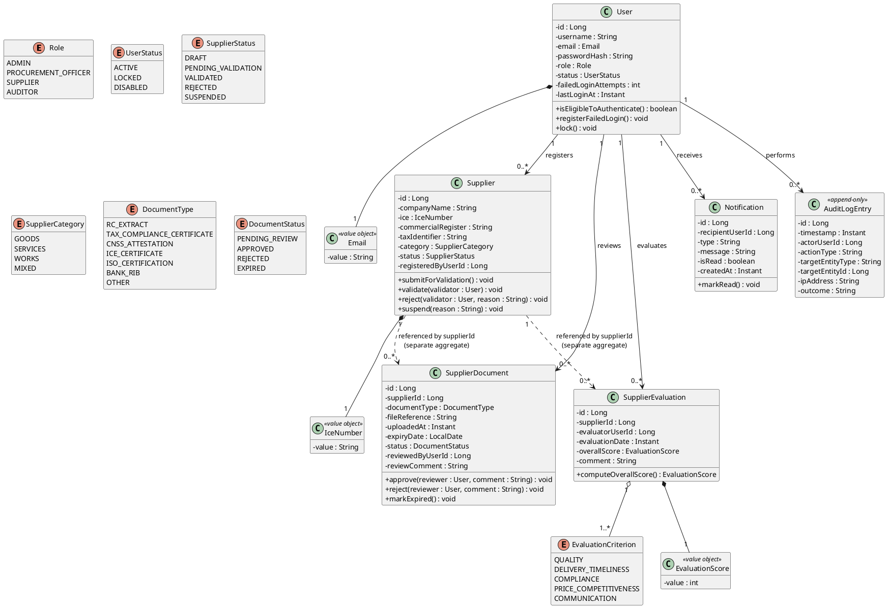

**Class responsibilities, one line each — the single reason each type exists:**

| Type | Responsibility |
|---|---|
| `User` | Represents an authenticatable identity and its account state; owns the login-failure/lockout invariant |
| `Role` | Closed enumeration of the four roles the system recognizes; authorization decisions key off this, never off a free-text string |
| `Supplier` | Represents a company's registration and validation lifecycle; owns the legal transition rules between statuses |
| `IceNumber`, `Email` | Value objects that make an invalid ICE number or malformed email unrepresentable — validated once, at construction, not re-validated defensively at every use site |
| `SupplierDocument` | Represents one submitted compliance document and its independent review lifecycle |
| `SupplierValidationPolicy` (domain service) | Decides whether a `Supplier` currently satisfies the conditions to move from `PENDING_VALIDATION` to `VALIDATED` — this logic spans multiple `SupplierDocument` instances, so it does not naturally belong to any single entity |
| `DocumentExpiryPolicy` (domain service) | Decides whether a document's `expiryDate` means it should transition to `EXPIRED` — pure function of a document and the current date, testable without any infrastructure |
| `SupplierEvaluation` | Represents one evaluation event and its computed overall score |
| `AuditLogEntry` | Immutable record of a single security- or business-relevant event; the type itself has no mutator methods, by design |
| `Notification` | Represents one delivery-tracked message to a user |

**Why value objects (`Email`, `IceNumber`) instead of plain `String` fields, given this is "just" a student project?** An invalid email address or a malformed ICE number becoming representable in the domain model is exactly the kind of defect that is cheap to prevent at the type level and expensive to chase down later as a "why did this null/malformed value reach production" bug. Validating once, at the boundary where a raw string becomes an `Email`, and never again downstream, is also what keeps validation logic from being duplicated across the controller, the service, and the entity — a direct application of AP3.

---

## 9. SOLID Principles Applied

SOLID is treated here as five concrete architectural commitments with a specific location in this codebase, not five definitions to recite.

**S — Single Responsibility Principle.** Enforced at the package level (Section 7), not just the class level: a REST controller's only reason to change is a change in the HTTP contract; a use case's only reason to change is a change in business orchestration; a JPA adapter's only reason to change is a change in how persistence is technically achieved. Concretely, `ReviewDocumentUseCase` never contains an `@Transactional` boundary decision mixed with HTTP status code logic — those live in different layers entirely (Section 5's trace makes this explicit).

**O — Open/Closed Principle.** New document types (`DocumentType` enum values) and new evaluation criteria (`EvaluationCriterion` enum values) are additive changes. Where behavior genuinely needs to vary per type rather than just data (for example, a future requirement that ISO certifications require a different expiry-grace-period than tax certificates), the **Strategy pattern** (Section 10) is used so the addition of a new document-type-specific policy does not require editing an existing `switch` statement buried in a use case — a new `DocumentExpiryStrategy` implementation is registered, and nothing existing is modified.

**L — Liskov Substitution Principle.** Every port interface (`SupplierRepository`, `NotificationSenderPort`, `TokenServicePort`) is designed so that **any** conforming implementation can be substituted without breaking a calling use case's expectations — including test doubles. A `InMemorySupplierRepository` used in a unit test (AP7) must satisfy exactly the same contract as `SupplierRepositoryImpl` backed by MySQL: if a use case's test passes against the in-memory fake but the behavior differs against the real adapter (for example, silently allowing a duplicate ICE number the real unique constraint would reject), that is treated as a Liskov violation to fix, not an acceptable test/production gap.

**I — Interface Segregation Principle.** Ports are defined per capability, not per technology. `application.document.port.FileStoragePort` exposes exactly `store(...)`, `retrieve(...)`, and `delete(...)` — a controller or use case that only needs to retrieve a file is never handed an interface that also lets it delete one. This is also why `TokenServicePort` (issue/validate/revoke JWTs) and `RefreshTokenStorePort` (persist/rotate refresh tokens) are two separate interfaces rather than one bloated `AuthPort` — a future implementation swapping only the refresh-token storage mechanism (for example, moving it to Redis) never has to also re-implement JWT issuance.

**D — Dependency Inversion Principle.** This is AP2 restated at the class level: `application` defines the ports; `infrastructure` depends on and implements them, never the reverse. Concretely, `ValidateSupplierUseCase` depends on the interface `SupplierRepository` (declared in `domain.supplier`), injected by the composition root — it has no compile-time knowledge that `SupplierRepositoryImpl` or Spring Data JPA exist at all.

---

## 10. Design Patterns Catalogue

Patterns are used where they solve a real, named problem in this system — not sprinkled in to look "enterprise." Each entry states the problem first.

| Pattern | Problem it solves here | Where it appears |
|---|---|---|
| **Repository** | Decouple domain/application from the specific persistence technology (AP6) | `SupplierRepository` (port, in `domain.supplier`) / `SupplierRepositoryImpl` (adapter, in `infrastructure.persistence.adapter`) |
| **Adapter** | Let Spring Security's `UserDetailsService` contract and the domain's `User` type coexist without the domain knowing Spring Security exists | `PortalUserDetailsService` wraps `UserRepository` and adapts `User` to Spring Security's `UserDetails` |
| **Strategy** | Vary document-expiry and validation behavior per `DocumentType` without an ever-growing `switch` | `DocumentExpiryPolicy` delegates to a per-type strategy resolved from a `Map<DocumentType, DocumentExpiryStrategy>` populated at startup |
| **Factory Method** | Centralize the construction rules for value objects that must never exist in an invalid state | `IceNumber.of(raw)`, `Email.of(raw)` validate and construct in one call, throwing a domain exception rather than returning a partially-valid object |
| **DTO + Mapper** | Prevent the JSON wire format, the JPA-mapped persistence shape, and the domain model from becoming the same accidentally-coupled class (a very common Spring Boot tutorial anti-pattern) | Three distinct representations per aggregate: `SupplierJpaEntity` (persistence), `Supplier` (domain), `SupplierResponse`/`RegisterSupplierRequest` (web), joined only by explicit mappers |
| **Specification** | Express composable query/validation predicates (e.g., "documents expiring within 30 days AND status = APPROVED") without leaking JPA Criteria API details into `application` | A small `Specification<T>` abstraction in `common`, with JPA-specific translation confined to `infrastructure.persistence` |
| **Chain of Responsibility** | Process an inbound HTTP request through authentication, then authorization, then request-correlation-id assignment, each independently testable | Spring Security's filter chain (`JwtAuthenticationFilter` before the authorization filter before the correlation-id filter) |
| **Observer (via domain events)** | Let "a document was reviewed" trigger both a notification *and* an audit-log entry without `ReviewDocumentUseCase` needing to know either consumer exists | `DocumentReviewed` domain event, published through a lightweight in-process `DomainEventPublisher` port, subscribed to by the notification and audit use cases |
| **Builder** | Construct richly-parameterized `AuditLogEntry` instances (many optional contextual fields) without a constructor with eleven positional parameters | `AuditLogEntry.builder()...build()` |
| **Facade** | Give `infrastructure.web.controller` classes one narrow entry point per use case instead of orchestrating three services per endpoint | Each `*UseCase` interface *is* the facade — a controller calls exactly one method per HTTP operation |

**Why an in-process event publisher instead of a full message broker (Kafka/RabbitMQ) for the Observer pattern above?** The same reasoning as Section 3's monolith-over-microservices call: there is one process, one database transaction most of the time, and no cross-service consumer. A broker would add operational surface (another service to run, another failure mode to handle) with no corresponding benefit at this scale. The `DomainEventPublisher` port is still defined as an interface (AP6), so if a genuine need for asynchronous, durable, cross-process event delivery appears later, only its implementation changes — not any use case that publishes or subscribes to events.

---

## 11. Database Design

**MySQL (via XAMPP) is the persistence engine for this project's development and defense environment**, InnoDB storage engine throughout (required for foreign-key enforcement and transactional integrity — MyISAM is never used, even for the append-only audit table, because losing crash-safety on the one table whose integrity matters most would be indefensible), character set `utf8mb4` with `utf8mb4_unicode_ci` collation to correctly store French-accented company and contact names without silent truncation or mojibake.

The `Repository`/port split (Sections 7, 9) keeps this reversible per AP6: a future production deployment on a managed PostgreSQL or MySQL instance changes `infrastructure.persistence` only.

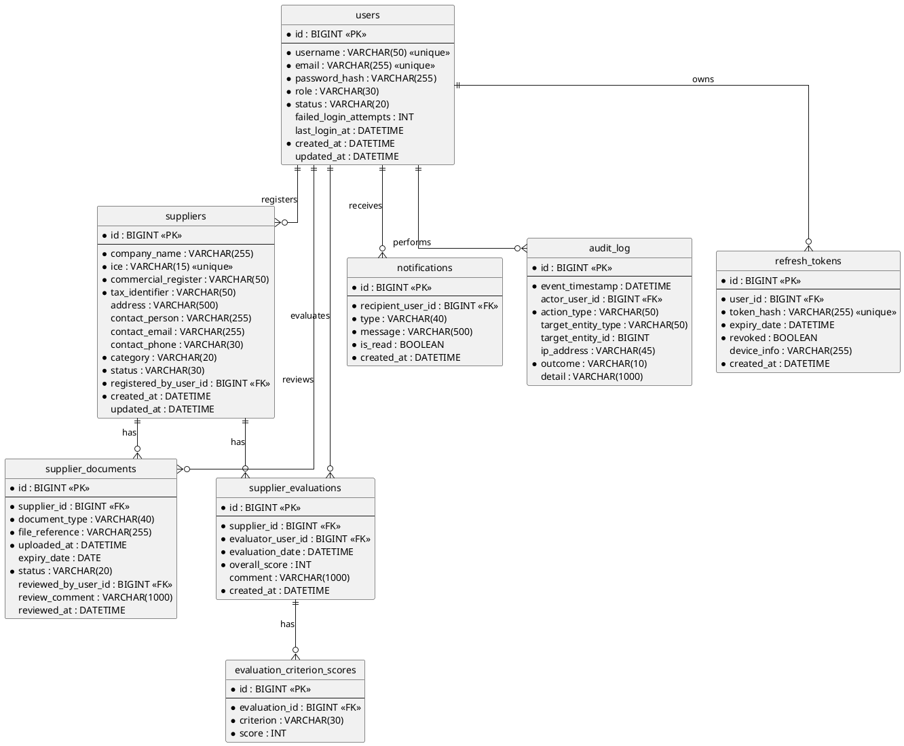

**Normalization:** the schema is in Third Normal Form throughout. `evaluation_criterion_scores` is deliberately its own table rather than a denormalized set of `quality_score`/`delivery_score`/... columns on `supplier_evaluations`, precisely because Section 9's Open/Closed reasoning applies to the schema too — a new `EvaluationCriterion` is a new row, never a migration adding a new column and a new piece of mapping code.

**Indexing strategy, justified by actual access patterns rather than added defensively everywhere:**

| Index | Reason |
|---|---|
| `suppliers.ice` (unique) | ICE is the legal, unique identifier of a Moroccan company; enforcing uniqueness at the database level is the last line of defense if an application-level check is ever bypassed |
| `suppliers.status` | The Procurement dashboard's single most frequent query is "suppliers by status" |
| `supplier_documents.status`, `supplier_documents.expiry_date` | Backs both the reviewer's "pending review" queue and the scheduled expiry-check job (Section 20) — a composite index on `(status, expiry_date)` covers both |
| `audit_log.event_timestamp`, `audit_log.actor_user_id` | The audit search screen (Section 14, Auditor role) filters by date range and by actor as its two primary axes |
| `refresh_tokens.token_hash` (unique) | Token validation on every authenticated request must be O(1), not a table scan |

**Why is `audit_log` given a database-level defense in addition to the application-level append-only contract (Section 8)?** Because AP4's traceability guarantee is only as strong as its weakest enforcement point. The dedicated MySQL application user the Spring Boot process connects with is granted `SELECT`, `INSERT` on `audit_log` **and explicitly not `UPDATE` or `DELETE`** — so even a SQL-injection vulnerability that somehow survived every layer in Section 13 could not rewrite history on this one table, because the database credential itself cannot perform that operation. This is defense in depth applied to a database grant, not just to application code — the same principle DNSSI's traceability rule and ASVS V7 (Section 14) both point at.

**Sensitive fields and encryption at rest:** `supplier_documents.file_reference` is an opaque storage key, never a raw filesystem path — the actual file (Section 20's storage adapter) is encrypted at rest with AES-256-GCM, keyed by a secret held outside the repository and outside the database (Section 23). Bank details submitted as the `BANK_RIB` document type are treated as a **file**, not as a structured, queryable database column — deliberately, since there is no legitimate query need to search suppliers by bank account number, and not storing a sensitive value as a queryable column is a stronger guarantee than encrypting a column that never needed to exist in the relational schema at all.

**Migrations are managed by Flyway, versioned and checked into `src/main/resources/db/migration`, never applied as manual `ALTER TABLE` statements against a running database.** The schema's history is itself reproducible and reviewable — a direct defense against the classic failure mode where a developer's local database silently drifts from what the codebase expects.

---

## 12. REST API Design

**Design principles, stated once so individual endpoints below don't need to re-justify them:**

- **URI-versioned from day one (`/api/v1/...`)**, even though there is exactly one client family (the static console) today. The same reasoning as Jarvis-style architecture documents apply broadly here: skipping versioning because "there's only one client anyway" is the shortcut that looks harmless until a breaking change is needed and something quietly depended on the old shape.
- **Resource-oriented, noun-based paths**; state transitions (`validate`, `reject`, `submit`, `review`) are modeled as sub-resource actions (`POST /suppliers/{id}/validate`) rather than as a generic `PUT /suppliers/{id}` with a status field — this makes the audit log (Section 21) able to record a precise, human-meaningful `actionType` directly from the route, rather than diffing a JSON body to infer what changed.
- **Errors follow RFC 7807 (Problem Details for HTTP APIs)** uniformly: every non-2xx response returns a `application/problem+json` body with `type`, `title`, `status`, `detail`, `instance`, plus a project-specific `traceId` (Section 20) and, for validation failures, an `errors` array of `{field, message}`. One shape, everywhere, is what lets the static frontend have exactly one error-handling code path instead of one per endpoint.
- **Pagination is uniform**: any list endpoint accepts `page`/`size`/`sort` query parameters and returns a wrapper `{content, page, size, totalElements, totalPages}` — never a bare JSON array, so a future filter or metadata field is additive, not breaking.
- **The API is documented from annotations via springdoc-openapi**, publishing a live OpenAPI 3 contract at `/v3/api-docs` and a Swagger UI at `/swagger-ui.html` in non-production profiles — the contract is generated from the same code that serves it, which is what keeps documentation from drifting the way a hand-maintained wiki page does.
- **Rate limiting on authentication endpoints** (`/api/v1/auth/login`): a token-bucket limiter (Bucket4j) keyed by source IP and by username, mitigating credential-stuffing and brute-force attempts — this is the concrete implementation of the "anti-automation" expectation in ASVS V11 (Section 14).

**Endpoint catalogue:**

| Method & Path | Roles allowed | Purpose |
|---|---|---|
| `POST /api/v1/auth/register` | Public (rate-limited) | Create a new `SUPPLIER`-role account and its associated draft `Supplier` record |
| `POST /api/v1/auth/login` | Public (rate-limited) | Authenticate; returns a short-lived access token and sets an `httpOnly` refresh-token cookie (Section 15) |
| `POST /api/v1/auth/refresh` | Authenticated via refresh cookie | Rotates the refresh token, issues a new access token |
| `POST /api/v1/auth/logout` | Authenticated | Revokes the current refresh token |
| `GET /api/v1/suppliers` | ADMIN, PROCUREMENT_OFFICER, AUDITOR | Paginated, filterable (`status`, `category`) supplier list |
| `GET /api/v1/suppliers/{id}` | ADMIN, PROCUREMENT_OFFICER, AUDITOR, owning SUPPLIER | Supplier detail |
| `PUT /api/v1/suppliers/{id}` | ADMIN, owning SUPPLIER (while `DRAFT`) | Update company profile fields |
| `POST /api/v1/suppliers/{id}/submit` | Owning SUPPLIER | Transition `DRAFT → PENDING_VALIDATION` |
| `POST /api/v1/suppliers/{id}/validate` | ADMIN, PROCUREMENT_OFFICER | Transition `PENDING_VALIDATION → VALIDATED` |
| `POST /api/v1/suppliers/{id}/reject` | ADMIN, PROCUREMENT_OFFICER | Transition `PENDING_VALIDATION → REJECTED`, with reason |
| `POST /api/v1/suppliers/{id}/suspend` | ADMIN | Transition `VALIDATED → SUSPENDED`, with reason |
| `POST /api/v1/suppliers/{id}/documents` | Owning SUPPLIER | Upload a compliance document (multipart) |
| `GET /api/v1/suppliers/{id}/documents` | ADMIN, PROCUREMENT_OFFICER, AUDITOR, owning SUPPLIER | List documents for a supplier |
| `GET /api/v1/documents/{id}/file` | ADMIN, PROCUREMENT_OFFICER, owning SUPPLIER | Stream the underlying file (Section 13's access checks apply per request, not just per endpoint) |
| `POST /api/v1/documents/{id}/review` | ADMIN, PROCUREMENT_OFFICER | Approve or reject a document, with comment |
| `POST /api/v1/suppliers/{id}/evaluations` | ADMIN, PROCUREMENT_OFFICER | Record a new evaluation |
| `GET /api/v1/suppliers/{id}/evaluations` | ADMIN, PROCUREMENT_OFFICER, AUDITOR, owning SUPPLIER | Evaluation history |
| `GET /api/v1/users` | ADMIN | List internal accounts |
| `PUT /api/v1/users/{id}/role` | ADMIN | Change a user's role |
| `PUT /api/v1/users/{id}/status` | ADMIN | Lock/unlock/disable an account |
| `GET /api/v1/audit-logs` | ADMIN, AUDITOR | Search the audit trail (date range, actor, action type) |
| `GET /api/v1/notifications` | Any authenticated user | List the caller's own notifications |
| `PUT /api/v1/notifications/{id}/read` | Owning recipient | Mark a notification read |

**Why is `GET /api/v1/documents/{id}/file` a distinct endpoint from the document metadata endpoint, rather than embedding the file as base64 in the JSON response?** Streaming binary content through a dedicated endpoint lets the response carry correct `Content-Type`/`Content-Disposition` headers, avoids inflating JSON payload size by roughly a third (base64 overhead), and — most importantly for Section 13 — lets that one route apply an explicit, auditable "does this caller have the right to read this specific file" check independently of the metadata check, rather than assuming that seeing the metadata implies the right to see the bytes.

---

## 13. Security Architecture

Security is treated as defense in depth: no single control — not JWT, not RBAC, not encryption — is trusted to carry the whole system, because in practice no single control ever does.

**The layers, and what each one is actually for:**

1. **Transport security** — TLS 1.2+ mandatory for every request, including same-machine development traffic where feasible; HSTS enforced so a browser never silently downgrades to plain HTTP after the first visit.
2. **Authentication** — JWT-based, stateless access tokens plus a server-side-tracked, rotating refresh token (Section 15). Account lockout after repeated failures, rate-limited login attempts.
3. **Authorization** — role-based at the coarse grain (can a `SUPPLIER` ever reach this endpoint at all), ownership-based at the fine grain (can *this* supplier reach *this* record) — deliberately two different mechanisms, discussed below.
4. **Input validation & output encoding** — Jakarta Bean Validation at every DTO boundary; parameterized queries exclusively through JPA/Hibernate; the static frontend encodes all user-originated content before insertion into the DOM, preventing stored/reflected XSS.
5. **Data protection at rest** — password hashes via BCrypt (cost factor 12); uploaded documents encrypted with AES-256-GCM before being written to disk; no sensitive field (bank details) is ever stored as a raw, queryable database column (Section 11).
6. **Centralized, immutable audit trail** — every authentication event (success or failure), every state transition, every permission denial is recorded to the append-only `audit_log`, database-enforced (Section 11), independent of the general rotating application log (Section 20).
7. **Secure configuration & secrets management** — no credential, signing key, or connection string is ever committed to Git; all are externalized (Section 23) and profile-scoped.
8. **Dependency and supply-chain hygiene** — Maven dependencies version-pinned, scanned in CI via the OWASP Dependency-Check plugin against the National Vulnerability Database before every merge to `main`.

### 13.1 Authentication Design

**JWT signed with RS256 (asymmetric), not HS256 (symmetric).** The private signing key is held only by the component that issues tokens (`infrastructure.security.jwt.JwtTokenProvider`); the public verification key can, in principle, be distributed to any component that only needs to *verify* a token — a small but real defense-in-depth gain over a single shared symmetric secret that, if it ever leaked from any verifying component, would also let an attacker forge new tokens.

**Two token types, deliberately asymmetric in how they are stored and how long they live:**

| | Access token | Refresh token |
|---|---|---|
| Format | JWT (self-contained: subject, role, `iat`, `exp`) | Opaque random value |
| Lifetime | 10–15 minutes | 7 days |
| Storage on client | In-memory JavaScript variable only — never `localStorage`, never a JS-readable cookie | `httpOnly`, `Secure`, `SameSite=Strict` cookie |
| Storage on server | Not stored (stateless, verified by signature) | Stored as a **salted hash**, never plaintext, in `refresh_tokens` |
| Revocation | Cannot be individually revoked before expiry — this is *why* its lifetime is kept short, to bound the exposure window | Individually revocable at any time (logout, admin action, reuse detection) |

**Why in-memory for the access token and an `httpOnly` cookie for the refresh token, rather than the far more common tutorial pattern of putting both in `localStorage`?** `localStorage` is readable by any JavaScript running on the page — including an attacker's script, if any XSS vulnerability is ever found anywhere on the static frontend (Section 13's input-validation layer aims to prevent that, but AP1's defense-in-depth logic says never rely on one layer alone). An `httpOnly` cookie is invisible to JavaScript entirely, which removes the refresh token — the credential with the long lifetime and the real damage potential — from XSS's reach. The trade-off, stated honestly: this reintroduces a *CSRF* surface on the `/auth/refresh` endpoint, mitigated by `SameSite=Strict` (which blocks the cookie from being sent on cross-site requests in any modern browser) plus a requirement that the request carry a custom header a cross-site form submission cannot set. The access token, meanwhile, is short-lived specifically so that if it *is* exfiltrated via some future XSS bug, the exposure window is measured in minutes, not days.

**Refresh token rotation with reuse detection.** Every successful call to `/api/v1/auth/refresh` invalidates the presented refresh token and issues a brand-new one. If a refresh token that has already been used (or already revoked) is ever presented again, that is treated as a signal of theft, not a bug: the entire token family for that user is revoked and re-authentication is forced. This is the standard OAuth 2.0 refresh-token-rotation pattern, and it converts "a refresh token leaked" from a silent, long-lived compromise into a detectable, self-limiting one.

**Password policy**, grounded in current guidance (NIST SP 800-63B) rather than outdated complexity-only rules, and aligned with ASVS V2 (Section 14.4): minimum 12 characters; no forced periodic rotation for ordinary users (rotation-on-schedule is now understood to encourage weaker, predictable password patterns); rejection against a local common/breached-password denylist at registration and password-change time; account lockout after 5 consecutive failures, with an increasing backoff rather than a permanent lock, to avoid turning the lockout mechanism itself into an easy denial-of-service lever against a known username. **Exact numeric thresholds here are a defensible starting point, not a substitute for the entity's designated RSSI formally setting them under the organization's DNSSI compliance program** — this document proposes values; it does not claim regulatory authority to fix them.

**Multi-factor authentication for privileged roles (`ADMIN`, `PROCUREMENT_OFFICER`)** is architected for — the `User` domain model's `status` and authentication flow have room for a second factor — but is scoped as a **Phase 2 enhancement** (Section 27) rather than claimed as delivered in this iteration, consistent with AP8's honesty about what is designed-for versus what is built.

### 13.2 Authorization Design

**Two deliberately different mechanisms, not one mechanism doing double duty:**

- **Role-based, coarse-grained, declarative:** Spring Security method security (`@PreAuthorize("hasRole('PROCUREMENT_OFFICER')")`) at the controller boundary answers "can a user with this role ever call this operation at all." This is a static, cheap check with no domain data involved.
- **Ownership-based, fine-grained, imperative:** "can *this* authenticated supplier see or modify *this specific* supplier record" is a business rule, not a framework concern, so it is enforced **inside the use case**, by comparing the authenticated principal's user ID against `Supplier.registeredByUserId` — the same way any other domain invariant is enforced, and just as unit-testable without a Spring Security context in play (AP7).

**Why not push ownership checks into `@PreAuthorize` SpEL expressions too, as many Spring Boot tutorials do?** A SpEL expression referencing a repository lookup (`@PreAuthorize("@supplierGuard.isOwner(#id)")`) works, but it makes a business rule un-testable except through a full Spring Security integration test, and it hides the rule inside an annotation string rather than inside a reviewable method body. Keeping ownership logic as ordinary Java inside the use case is simply Section 9's Dependency Inversion and Section 7's layer-responsibility table applied consistently, not a special exception carved out for security code.

**Default posture is deny.** A new endpoint with no explicit `@PreAuthorize` annotation is rejected by a global method-security configuration default (`denyAll` unless annotated) rather than silently permitted — the absence of a decision must never resolve to "allowed."

### 13.3 OWASP Top 10 (2021) Mapping

| Risk | Concrete architectural control |
|---|---|
| **A01 Broken Access Control** | RBAC + ownership checks (13.2), default-deny method security, no direct object reference without an ownership or role check |
| **A02 Cryptographic Failures** | BCrypt (cost 12) for passwords, AES-256-GCM for encrypted document storage, TLS 1.2+ everywhere, RS256-signed JWTs |
| **A03 Injection** | JPA/Hibernate parameterized queries exclusively — no string-concatenated JPQL or native SQL anywhere in `infrastructure.persistence`; Bean Validation at every DTO boundary |
| **A04 Insecure Design** | This document itself, plus an explicit threat model (13.5) and workflow state machines (Section 16) that make invalid state transitions structurally unrepresentable, not just discouraged |
| **A05 Security Misconfiguration** | Environment-scoped Spring profiles, externalized secrets (Section 23), security headers (HSTS, `X-Content-Type-Options`, `X-Frame-Options`, a restrictive Content-Security-Policy) applied globally, verbose error detail disabled outside the `dev` profile (Section 22) |
| **A06 Vulnerable & Outdated Components** | Maven dependency versions pinned; OWASP Dependency-Check scans every build against the National Vulnerability Database |
| **A07 Identification & Authentication Failures** | Short-lived access tokens, rotating refresh tokens with reuse detection, lockout with backoff, login rate limiting (Section 12) |
| **A08 Software & Data Integrity Failures** | Flyway-checksummed migrations, Git-reviewed changes even in a solo workflow (self-review against a PR checklist before merge, Section 27), pinned dependency versions |
| **A09 Security Logging & Monitoring Failures** | Structured logging with correlation IDs (Section 20), immutable audit trail (Section 21) covering every authentication and authorization-relevant event |
| **A10 Server-Side Request Forgery** | Not currently applicable — this system never fetches a user-supplied URL server-side. Flagged explicitly here so that if a future feature ever introduces one (e.g., "verify supplier website"), that feature's design is required to revisit this control rather than adding an outbound fetch unnoticed |

### 13.4 Input Validation, File Upload & Output Handling

Every inbound DTO is annotated with Jakarta Bean Validation constraints (`@NotBlank`, `@Size`, `@Pattern`) plus two custom constraints specific to this domain: `@ValidIce` (structural validation of a Moroccan ICE number) and `@ValidRc` (commercial register format). Validation failures short-circuit before any use case executes and are translated uniformly to RFC 7807 responses (Section 12).

**File upload handling** (`POST /suppliers/{id}/documents`) applies, in order: (1) an allow-listed content-type and file-extension check — never a deny-list — (2) a maximum size limit enforced both at the web-server and application level, (3) the file is renamed to a generated, non-guessable storage key before it ever touches disk, so a supplier can never control the path or filename their upload is stored under, and (4) the file is encrypted at rest immediately upon receipt, before the use case returns a response, so there is no window where an unencrypted copy exists on disk outside of transient memory.

**Output encoding on the static frontend:** every value that originates from user input (a company name, a review comment) is inserted into the DOM exclusively through methods that treat it as text (`textContent`, or an equivalent escaping helper in the shared `assets/js` utilities), never through `innerHTML` concatenation — the single most common source of stored XSS in hand-rolled vanilla-JS frontends.

### 13.5 Threat Model — Stated Honestly

**Defended against:** a compromised or guessed credential (bounded by lockout, rate limiting, and short-lived tokens); a stolen access token (bounded to a several-minute window); a stolen refresh token (individually revocable, rotation-detected on reuse); SQL injection and stored/reflected XSS (13.3, 13.4); tampering with the audit trail by the application itself (Section 11's database-grant-level enforcement); and a supplier attempting to access another supplier's records or documents by guessing or altering an identifier (13.2's ownership checks, applied per request, not just per session).

**Explicitly out of scope, stated plainly rather than implied away:** protection against a fully compromised MySQL server host or operating system (host-level hardening is an operational concern for whichever environment ultimately runs this system, addressed at the level of a recommendation in Section 19, not a guarantee this application-layer architecture can make); protection against a compromised developer workstation with access to signing keys or the Git repository; and formal, automated static/dynamic application security testing (SAST/DAST) tooling, which is recommended (Section 24) but not assumed to already be running. No architecture eliminates all risk; naming the boundary honestly is part of the design, not a gap being hidden.

---

## 14. DGSSI / DNSSI Compliance Mapping

This section is where "compliant with DGSSI Security Standards" (the project brief) is turned into specific, traceable architectural commitments, rather than left as an aspiration on a cover page.

### 14.1 Regulatory Foundation

The **Direction Générale de la Sécurité des Systèmes d'Information (DGSSI)**, established under the Administration de la Défense Nationale by Decree n°2-11-509 (September 21, 2011), is Morocco's national authority for information systems security. Its central operational text is the **Directive Nationale de la Sécurité des Systèmes d'Information (DNSSI)** — first issued in 2014 (Circular n°3/2014) and updated by Circular n°2/2023 (January 12, 2023), the version this document treats as current. The DNSSI's obligations trace back to **Law n°05-20** on cybersecurity (2020) and its implementing **Decree n°2-21-406** (2021), which formally bind public administrations, public institutions, and operators of Vital Importance Infrastructure (*Infrastructures d'Importance Vitale*, IIV).

**As established in Section 2's assumptions, this project does not claim to operate within a formally-designated IIV** — the DNSSI's mandatory-audit obligations, and the requirement to use a DGSSI-qualified audit provider (PASSI), are not asserted as legally applicable here. DNSSI and its companion application-security referential are adopted **as this architecture's chosen reference framework**, on the reasoning that designing to a real, current national standard demonstrates more than designing to an invented, self-graded one.

### 14.2 Information System Classification

The DNSSI classifies information systems into three sensitivity classes — **A, B, and C** — jointly determined between an entity and the DGSSI, with Class A systems facing the most stringent measures and audit frequency. This project has no DGSSI-assigned classification (Section 14.1), so it adopts a **working classification of Class B** as the anchor for how much control intensity to design for — chosen deliberately rather than defaulting to "as secure as possible" with no stated reference point:

- The system handles **personal data** (contact names, emails, phone numbers) and **business-identifying data** (ICE, commercial register number, tax identifier) whose compromise would cause real reputational and legal exposure.
- It handles a **reference to financial data** (bank RIB, held as a document, not a live payment credential) rather than transactable financial instruments.
- It does not process state secrets, safety-of-life data, or anything that would place it at Class A, and it is materially more sensitive than a purely public-facing informational site, which rules out Class C.

### 14.3 The Eleven DNSSI Security Domains — Architectural Mapping

The DNSSI structures its security rules into eleven domains, closely mirroring the ISO/IEC 27002 control structure the DGSSI itself points entities toward as a maturity path. The first three below are drawn directly from the DNSSI's own published table of contents; the remaining eight follow the same referential's domain structure. Each is mapped here to where this architecture concretely addresses it — and, where a domain is organizational or physical rather than software-architectural, that boundary is stated honestly rather than glossed over.

| # | DNSSI Domain | How this architecture addresses it |
|---|---|---|
| 1 | Politique de sécurité (Security Policy) | This document *is* the system-level security policy artifact — Section 0's AP1–AP8 are the binding tie-breaking principles for every design decision, revisited at each roadmap milestone (Section 27) |
| 2 | Organisation de la sécurité (Organization of Security) | The `AUDITOR` role (Section 8) is structurally independent of `ADMIN` — an administrator cannot be the sole reviewer of their own actions, which is what lets the audit trail (Section 21) function as genuine oversight rather than self-attestation; the one external "tiers" (third party) dependency, the SMTP relay (Section 20), is scoped to carry no sensitive payload beyond a notification message |
| 3 | Gestion des biens (Asset Management) | Every domain entity, configuration item (Section 23), and third-party dependency (Section 13.3, A06) is an inventoried asset with a designated owning role — the software-architecture-level expression of DNSSI's requirement (Objectif O.4) to inventory assets and assign an owner |
| 4 | Sécurité RH (Human Resources Security) | Out of scope for a software architecture document — this is an organizational/HR process. What the *system* provides is the interface into it: account provisioning and the `DISABLED` status transition (Section 8) that an offboarding process would trigger |
| 5 | Sécurité physique et environnementale (Physical & Environmental Security) | Out of scope for a software architecture document; addressed only at the level of a hosting recommendation in Section 19, since physical security is a property of premises and hardware, not application code |
| 6 | Gestion de l'exploitation (Operations & Communications Management) | Network segmentation recommendation for any future production deployment (Section 19), TLS everywhere (13.1), scheduled-job operations (Section 20) |
| 7 | Contrôle d'accès (Access Control) | Section 13.2 and Section 15 in full |
| 8 | Acquisition, développement, maintenance des SI (Systems Acquisition, Development & Maintenance) | This entire document — security-by-design (AP1) from the first architectural decision, not retrofitted; Section 24's testing strategy; dependency scanning (13.3, A06) |
| 9 | Gestion des incidents (Incident Management) | Section 21's audit trail is the detection substrate; Section 26 discusses response. If the operating organization is ever itself designated an IIV, the incident-reporting channel to DGSSI/maCERT is an organizational process this system's exportable, queryable audit log enables — not one the application itself performs |
| 10 | Continuité de l'activité (Business Continuity) | Section 19's backup note: because all durable state lives in one MySQL database plus one encrypted file store, a coherent backup is a two-target operation, not a many-service coordination problem |
| 11 | Conformité (Compliance) | This section, Section 24's testing strategy, and Section 2's explicit, honest statement of what regulatory status this project does *not* claim |

### 14.4 Application-Level Verification — DGSSI's ASVS-Based Referential

DGSSI's own **Référentiel de vérification de la sécurité des applications** is explicitly built on **OWASP ASVS 4.0.3** (published October 2021) — which means the most direct, current, and authoritative way to demonstrate DGSSI-aligned application security here is to show this architecture satisfies ASVS's fourteen chapters directly, rather than inventing a parallel checklist. Given the Class B target (14.2), this architecture is designed to **ASVS Level 2** — the level intended for applications handling sensitive business and personal data, one level below the Level 3 rigor reserved for safety-critical or national-security systems this project does not claim to be.

| ASVS Chapter | Architectural evidence |
|---|---|
| V1 — Architecture, Design & Threat Modeling | This entire document; the explicit, honest threat model in Section 13.5 |
| V2 — Authentication | Section 13.1 (JWT design, password policy, lockout) |
| V3 — Session Management | Section 13.1's token lifecycle table; Section 15 |
| V4 — Access Control | Section 13.2 (role + ownership dual mechanism) |
| V5 — Validation, Sanitization & Encoding | Section 13.4 |
| V6 — Stored Cryptography | Section 11 (AES-256-GCM at rest, BCrypt hashing); Section 23 (key management) |
| V7 — Error Handling & Logging | Section 20 (structured logging); Section 22 (no stack traces leaked to clients) |
| V8 — Data Protection | Section 11's data-minimization decision (bank details never a queryable column) |
| V9 — Communications | TLS 1.2+ and HSTS, Section 13, layer 1 |
| V10 — Malicious Code | Dependency scanning (13.3, A06); no dynamic code evaluation or unsafe deserialization anywhere in the design |
| V11 — Business Logic | Workflow state machines (Section 16) that make invalid transitions structurally unrepresentable; login rate limiting (Section 12) |
| V12 — Files & Resources | Section 13.4's upload handling (allow-listing, generated storage keys, immediate encryption) |
| V13 — API & Web Service | Section 12 in full (versioning, RFC 7807, content-type enforcement) |
| V14 — Configuration | Section 23 |

### 14.5 Data Residency

DNSSI requires that **sensitive data belonging to an entity be hosted on national territory**. The XAMPP/MySQL development environment trivially satisfies this (it runs on the developer's own machine, in Morocco). This constraint is carried forward explicitly into Section 19's deployment architecture: any future production hosting decision for this system is scoped to Moroccan-territory infrastructure, or a specifically compliance-reviewed exception, rather than a default assumption that "any cloud region" is an acceptable choice.

### 14.6 Protecting This Document Itself

DNSSI treats an entity's own network and architecture documentation as sensitive material requiring its own protection, precisely because it is a map of the system's defenses. This document's cover page classification line reflects that: this Software Architecture Document is written to be shared with the academic jury and the project's future maintainer, not published in the same public repository as the implementation code without consideration of that fact.

---

## 15. Authentication & Authorization Deep Dive

Section 13 established the design; this section shows it as executable sequences, which is where a subtle mistake (a check performed in the wrong order, a token issued before a failure path is checked) would actually be caught.

**Login:**

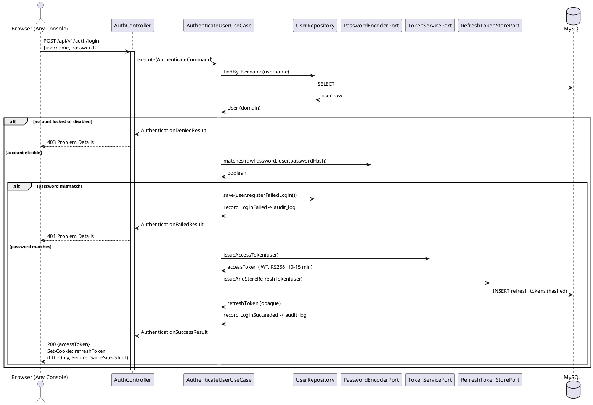

**Refresh, with reuse detection:**

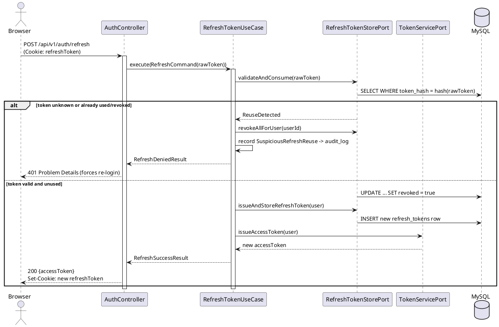

**Why does a failed login still write to `users` (the failure counter) before returning an error, rather than just returning 401 and moving on?** Because the lockout mechanism (Section 13.1) only works if failures are counted somewhere durable — an in-memory counter would reset on every application restart and would not be shared if this process were ever scaled to more than one instance. Persisting the counter is a small write cost paid on every failed attempt in exchange for a lockout guarantee that survives both restarts and horizontal scaling.

---

## 16. Core Workflows

### 16.1 Supplier Registration & Submission

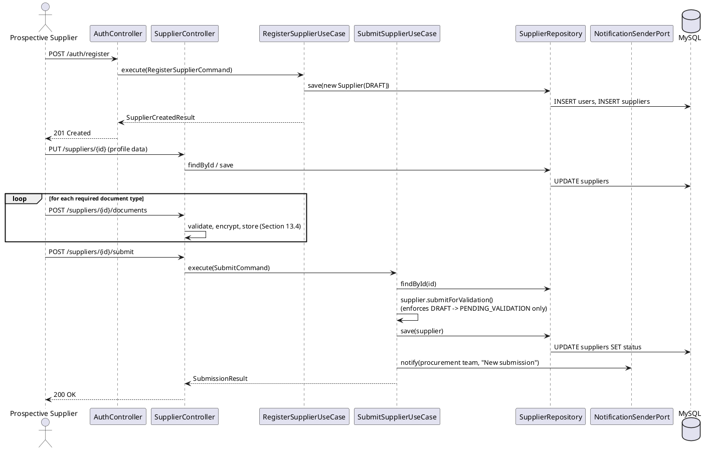

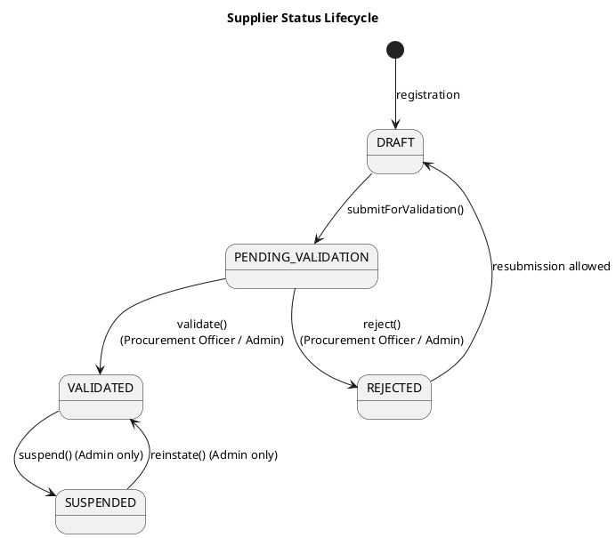

### 16.2 Document Submission & Review

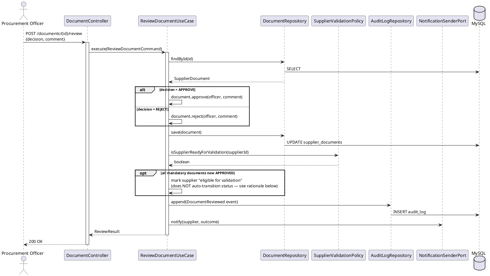

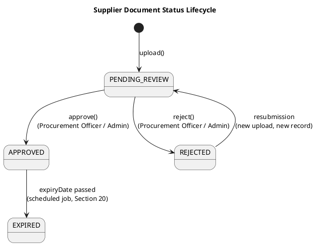

**Why does all-documents-approved *not* automatically transition the supplier to `VALIDATED`?** Because document completeness is a necessary, not a sufficient, condition — a Procurement Officer may still want to check something a document cannot capture (a reference call, a site visit). Making `validate()` a separate, explicit, human-triggered action keeps a real accountability decision attached to a real actor and a real timestamp in the audit trail, rather than letting a batch of document approvals silently produce a validation decision nobody explicitly made. `SupplierValidationPolicy.isSupplierReadyForValidation(...)` still runs and its result is surfaced to the officer as "ready to validate," so the check is not lost — it informs the human decision instead of replacing it.

---

## 17. Component Diagram

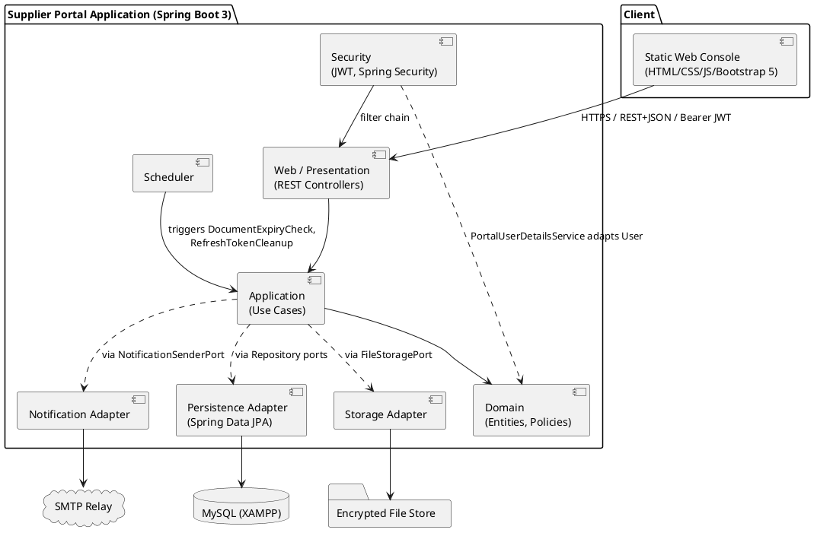

---

## 18. Use Case Diagram

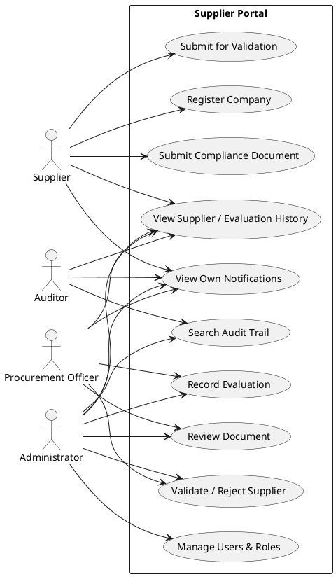

**Why can `Admin` reach every Procurement Officer use case, but `Officer` cannot reach `Manage Users & Roles`?** This mirrors Section 13.2's least-privilege posture (AP5) applied to role design itself, not just to enforcement: `ADMIN` is a superset by business necessity (someone must be able to act if the sole Procurement Officer is unavailable), but the reverse grant is never assumed — a Procurement Officer gaining user-management rights would be a privilege escalation with no matching business justification, so it is not modeled, not just "not currently used."

---

## 19. Deployment Architecture

**Two environments are described here, deliberately kept distinct rather than presenting the academic setup as if it were an enterprise deployment:**

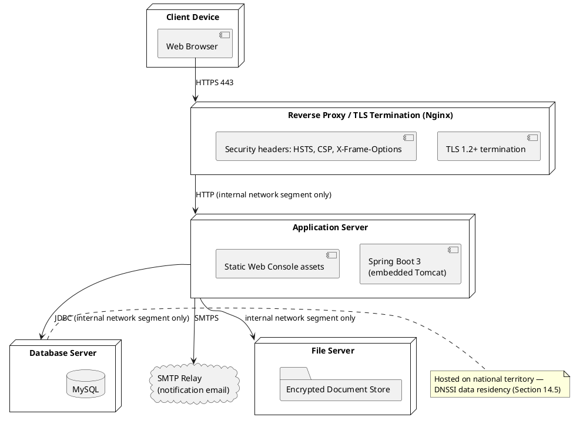

**Development / academic-defense environment (what actually runs today):** a single machine running XAMPP's MySQL/phpMyAdmin alongside the Spring Boot application (its own embedded Tomcat, no separate application-server install needed), with the static console served either from Spring Boot's static-resource handler or a lightweight local file server during frontend-only iteration. There is no reverse proxy and no network segmentation, because there is no network — everything is one machine, which trivially satisfies Section 14.5's data-residency requirement but does **not** exercise the TLS-termination and network-segmentation controls the diagram above describes. This gap is named explicitly, not hidden: Section 26 lists it as an accepted, scoped-out risk for the academic context, not a false claim of production-readiness.

**Target production topology (the recommendation this architecture is designed to support without rework, per AP6):** a reverse proxy terminating TLS and applying security headers uniformly, an application tier running the same Spring Boot artifact unchanged, a database tier (managed MySQL or a drop-in replacement, Section 11) reachable only from the application tier's network segment, and file storage similarly segmented — the "cloisonnement" (network partitioning) DNSSI's operations domain (14.3, domain 6) calls for, applied concretely rather than left as a policy statement.

| | Development (current) | Production (recommended target) |
|---|---|---|
| TLS | Optional, localhost | Mandatory, terminated at the reverse proxy, HSTS enforced |
| Database | XAMPP MySQL, same machine | Dedicated database tier, network-isolated, national territory (14.5) |
| Secrets | Local, untracked `.env` (Section 23) | Environment-injected or dedicated secrets manager |
| Logging verbosity | `DEBUG` permitted | `INFO` and above only; no request/response body logging |
| Backups | Manual `mysqldump` before milestones | Scheduled, automated, tested restore procedure |

**Backup strategy.** Because all durable state lives in exactly one MySQL database plus one encrypted file directory (Section 11), a coherent backup is a two-target operation with no cross-service coordination required — the same operational-simplicity argument that justified MySQL over a more complex multi-datastore design in the first place. A restore is verified periodically, not just assumed to work because a backup file exists (DNSSI's business-continuity domain, 14.3 domain 10, is precisely about this distinction).

---

## 20. Logging Architecture

**SLF4J as the logging facade, Logback as the implementation** (Spring Boot's default pairing) — structured, JSON-formatted output in any profile beyond `dev`, so log lines are machine-parseable by a future log aggregator without a reformatting step.

**Every inbound request is assigned a correlation ID** at the edge (a `CorrelationIdFilter`, first in the filter chain, ahead of authentication) — either generated fresh or propagated from an `X-Correlation-Id` header if the caller already supplied one. The ID is placed in Logback's MDC (Mapped Diagnostic Context) for the lifetime of the request, so **every log line emitted while handling that request carries the same ID**, and the same ID is returned as the `traceId` field in every RFC 7807 error response (Section 12). This is what turns "a user reports an error" into "search the logs for this one traceId" instead of an archaeology exercise across timestamps.

**What is logged, and at what level:** `INFO` for use-case entry/exit on state-changing operations (without payload bodies); `WARN` for recoverable failures (a validation rejection, a business-rule refusal); `ERROR` for unexpected exceptions, always with the correlation ID, never with a raw stack trace exposed past the server boundary (Section 22). `DEBUG` (request/response bodies, SQL statements) is permitted only in the `dev` profile and is structurally disabled — not just defaulted off — in `prod`.

**What is never logged, by rule, not by hope:** raw passwords, JWTs or refresh tokens in full, decrypted document content, and full request bodies for any endpoint touching `SupplierDocument` or `User` credentials. A dedicated `LogRedactionPolicy` (mirroring the value-object validation pattern from Section 8: one implementation, applied consistently) masks or omits these fields before a log statement is ever written, rather than trusting every call site to remember to do so individually.

**Rotation and retention:** size- and time-based rolling via Logback's `RollingFileAppender` (daily rotation, size cap per file, a bounded number of archived files retained — a shorter, purely operational retention window than the audit trail's, since these are debugging logs, not the compliance record). **Centralized log aggregation (e.g., an ELK stack or Grafana Loki) is architected for — the structured JSON output and correlation-ID discipline are exactly what such a system consumes — but is scoped as a Phase 2 infrastructure addition (Section 27), not claimed as already running.**

---

## 21. Auditing & Traceability

This is AP4 made concrete, and it is the single chapter of this document DNSSI's traceability rule (14.3, domain 1 and 8) most directly targets.

**What is recorded to the append-only `audit_log`** (as distinct from the operational logs in Section 20 — the two are deliberately separate systems with separate retention rules, never conflated): every authentication attempt, successful or not; every `Supplier` status transition and who performed it; every `SupplierDocument` review decision and comment; every evaluation recorded; every user role or status change; and every authorization denial (a request that reached the API but was refused by Section 13.2's checks) — a denial is exactly as security-relevant as a success, and is recorded with equal rigor.

**Tamper-evidence beyond the database-grant protection already described (Section 11).** Each `AuditLogEntry` additionally stores a `previousEntryHash` and computes its own `entryHash` as a cryptographic hash of its own fields concatenated with the previous entry's hash — a simple hash chain, the same structural idea that makes a blockchain's ledger tamper-evident, applied here at a much smaller scale. This does not prevent tampering by itself (that is the database grant's job, Section 11), but it means that **even a tamper performed with full database credentials** — bypassing the application entirely — would break the chain at a detectable point, rather than leaving a silently-edited history indistinguishable from a legitimate one.

**Retention.** This document proposes a minimum online retention of twelve months with archival beyond that, long enough to cover a full annual compliance review cycle — but, consistent with Section 13.1's honesty about password-policy numbers, **the entity's designated RSSI is the appropriate authority to set the definitive retention period** under its DNSSI compliance program; this architecture's job is to make any retention period the RSSI chooses technically enforceable (immutable storage, no silent deletion path), not to legislate the number itself.

**Query surface for the Auditor role:** `GET /api/v1/audit-logs` (Section 12) supports filtering by date range, actor, action type, and target entity — the concrete implementation of "who did what, when, and was it authorized" being answerable in seconds, not a database export and a spreadsheet.

---

## 22. Error Handling & Resilience

**A single `GlobalExceptionHandler` (`@RestControllerAdvice`)** is the only place an exception is translated into an HTTP response — mirroring Section 20's "one redaction policy, not one per call site" principle. Each `DomainException` subtype (`ValidationException`, `NotFoundException`, `UnauthorizedActionException`, `ConflictException`, `InvalidStateTransitionException`) maps to exactly one HTTP status and one RFC 7807 `type` URI, defined once, applied everywhere. An unanticipated exception falls through to a generic `500` response carrying only a `traceId` — full detail goes to the server log (Section 20), keyed by that same ID, never to the client, in any profile outside `dev`.

**Invalid state transitions fail at the domain layer, not the database layer.** `Supplier.validate()` called on a supplier not currently `PENDING_VALIDATION` throws `InvalidStateTransitionException` before any repository call is made — the same invariant Section 16's state diagrams describe is enforced in code, not merely documented as an expectation.

**Notification delivery is decoupled from the business transaction it originates from.** `NotifyDocumentReviewedUseCase` runs *after* the document-review transaction has already committed (Section 16.2's trace shows this ordering), and a failure to send the notification email is logged and queued for retry — it never rolls back, and never blocks, the review decision itself. Coupling "was the supplier notified" to "was the document actually reviewed" would make an SMTP outage capable of blocking core business operations, which is a resilience failure with no corresponding benefit.

---

## 23. Configuration Management

**No secret — database credential, JWT signing key, SMTP credential, file-encryption key — is ever committed to Git, in any profile.** Development configuration lives in an untracked `application-local.yml` (or `.env`, consumed via Spring's environment-variable binding), explicitly listed in `.gitignore` from the very first commit, not added after an accidental leak. Production configuration is injected by the hosting environment or a dedicated secrets manager (Section 19) — never baked into a committed properties file, regardless of environment.

**Profile-scoped configuration (`application.yml` plus `application-{dev,test,prod}.yml`)** governs everything that legitimately differs by environment: logging verbosity (Section 20), CORS-allowed origins, token lifetimes, and the active datasource. **Configuration is validated at startup, fail-fast:** `@ConfigurationProperties` classes bound to required settings (the JWT key path, the encryption key reference) are annotated so that a missing value stops the application from starting at all, rather than surfacing as a mysterious `NullPointerException` the first time a request actually needs that value — a slow, loud failure at boot is always preferable to a fast, silent one in production.

**The JWT signing key pair (RS256, Section 13.1) is generated once, outside the application, and referenced by file path or environment variable** — the application never generates its own signing key at runtime, which would make every restart implicitly invalidate every access token still in flight.

---

## 24. Testing Strategy

**The test pyramid, sized by what each layer costs to run and what it actually proves:**

```
                    /\
                   /  \        End-to-end (fewest): full HTTP flows
                  /----\        against a running instance (RestAssured)
                 /      \
                /--------\     Integration (some): Spring Boot Test slices,
               /          \     real MySQL via Testcontainers
              /------------\
             /              \  Unit (most): domain + application,
            /----------------\  zero Spring context, zero database
```

- **Unit tests** cover `domain` and `application` almost exclusively — no Spring context is started, no database is touched (AP7 made testable, not just asserted). `Supplier.submitForValidation()` rejecting a call from any status other than `DRAFT` is a plain JUnit 5 test against a plain Java object.
- **Integration tests** use `@DataJpaTest` for repository adapters and `@WebMvcTest` for controllers in isolation, plus a smaller number of full `@SpringBootTest` cases wiring the real stack together. **Integration tests run against a real MySQL instance via Testcontainers, not an in-memory H2 substitute** — deliberately, because H2's SQL dialect and case-sensitivity behavior differ from MySQL's often enough that a green H2 suite has, in practice, hidden real production bugs in other projects. Paying Testcontainers' slower startup cost buys back confidence that "tests pass" and "works against the real database" mean the same thing.
- **End-to-end tests** (fewest, most expensive) drive the actual REST API over HTTP against a fully running instance, covering the handful of flows where a genuine regression would be most costly: login → access a protected resource → refresh → logout, and the full supplier registration-to-validation path.
- **Architecture tests (ArchUnit)** are a fourth, orthogonal category, not part of the pyramid proper — they don't test behavior, they test that Section 5's boundary rules still hold, on every build.

**Security-specific testing:** OWASP Dependency-Check (Section 13.3, A06) runs on every build; an OWASP ZAP baseline (passive) scan is run against a running instance before each major milestone, as the closest approximation to a professional dynamic scan that fits a solo-developer, no-budget context — named honestly as a baseline scan, not equated with a qualified third-party penetration test, which this project does not claim to have undergone (Section 13.5).

**Coverage target:** ≥80% line coverage on `domain` and `application` (the cheapest layers to test well and the highest-value ones to get right), ≥70% overall. **Coverage is treated as a signal, not a goal in itself** — a test asserting only that a method "doesn't throw" inflates the number without proving the behavior in Section 8's class responsibilities table is actually correct; a test suite is reviewed for whether it exercises the *stated invariants* (a supplier cannot skip `PENDING_VALIDATION`, a document review requires a comment on rejection), not just for the percentage it reports.

**Test data:** built via **Test Data Builders** (`aSupplier().withStatus(DRAFT).build()`-style fluent construction, conceptually — no code shown, per this document's constraint) rather than copy-pasted setup blocks, so a test's *relevant* difference from its neighbors is visible at a glance instead of buried in ten identical setup lines.

---

## 25. Non-Functional Requirements

| Quality attribute | Requirement |
|---|---|
| **Performance** | p95 response time under 300 ms for standard CRUD operations (excluding file upload/download) under expected load — an internal supplier-management portal serving a bounded set of suppliers and staff, not internet-scale public traffic |
| **Availability** | No formal high-availability target for the academic deployment (single instance is an accepted, stated scope); the stateless-access-token design (Section 13.1) and the port-based persistence layer (Section 7) mean horizontal scaling is architecturally possible without redesign, should a future deployment need it |
| **Scalability** | Vertical scaling sufficient for current scope; horizontal scaling would additionally require moving the rate limiter (Section 12) and refresh-token store (Section 13.1) to a shared backing store (Redis) rather than in-process/single-database state — flagged as a Phase-2 infrastructure change (Section 27), not a v1 requirement |
| **Maintainability** | Bounded by the ArchUnit-enforced package boundaries (Section 5) and package-by-feature structure (Section 6) — a change to one bounded context should not require touching another |
| **Usability & accessibility** | Bootstrap 5 responsive layouts across the three consoles; semantic HTML, sufficient color contrast, and full keyboard navigability for form-heavy screens (document upload, review, evaluation) — accessibility as a baseline default, not an afterthought pass |
| **Security** | Section 13 and Section 14 in full |
| **Auditability** | Section 21 in full |
| **Portability** | Pure Java 21/Spring Boot 3 with no OS-specific dependency; Maven-managed, reproducible builds |
| **Localization** | French is the primary interface language, matching the operating context of Moroccan procurement and the domain vocabulary already used throughout this document (Fournisseur, Agent Achats, RSSI); every user-facing string is externalized through Spring's `MessageSource` resource bundles from the start, so adding a second language later is additive, never a rewrite (AP6, AP8) |

---

## 26. Risk Analysis & Threat Model

Section 13.5 already named the application-security threat boundary honestly. This section widens the lens to the project as a whole — technical, security, and delivery risk together, because a "Principal Architect" perspective treats an unrealistic schedule as seriously as an unencrypted column.

| # | Risk | Category | Likelihood | Impact | Mitigation |
|---|---|---|---|---|---|
| R1 | Single point of development — one student, no second reviewer | Project | High | High | This document plus lightweight ADRs (`docs/adr/`) let any future reader — including the same student returning after months away — reconstruct *why*, not just *what* (AP8) |
| R2 | Security/compliance depth (Sections 13–15) underestimated against the academic timeline | Schedule | Medium | High | Security fundamentals (JWT, RBAC, encryption, audit trail) are sequenced into Phase 1 of the roadmap (Section 27), not deferred as "polish" |
| R3 | XAMPP/local-machine dev environment masks production concerns (TLS, network segmentation) | Technical | High | Medium | Named explicitly (Section 19) rather than implied away; closing the gap later is a configuration change, not an architectural rewrite (AP6) |
| R4 | Scope creep beyond Section 2's stated non-goals | Project | Medium | Medium | Non-goals are written down and re-checked at each roadmap milestone, not left as an unstated assumption |
| R5 | Dependency vulnerability disclosed after initial development | Security | Medium | Medium-High | OWASP Dependency-Check runs on every build (13.3, A06) — a continuous check, not a one-time audit |
| R6 | Compromised developer workstation exposing signing keys or repository access | Security | Low–Medium | High | Explicitly out of this application architecture's scope (13.5); mitigated operationally, not architecturally — named rather than silently assumed away |
| R7 | Academic jury expects a simpler layered structure and questions Clean Architecture's extra indirection | Project | Low | Low | This document's "why X and not Y" reasoning, present at every major decision point, functions as the defense narrative itself |

---

## 27. Development Roadmap

A single-developer delivery cadence, sequenced so that **a secure, working core exists early**, and every later phase adds capability without touching what already works — the roadmap is itself a demonstration of AP6 (replaceability) and AP3 (single responsibility), applied to project planning rather than just to code.

| Phase | Focus | Indicative duration | Exit criterion |
|---|---|---|---|
| **0 — Foundation** | Repository scaffolding, Maven build, Flyway baseline migration, CI skeleton, ArchUnit rule set committed *before* the first feature (Section 5) | 1–2 weeks | `mvn verify` runs green on an empty-but-structured skeleton; architecture rules are enforced from commit one, not retrofitted |
| **1 — Identity & Access** | `User`/`Role` domain, JWT issuance and refresh (Section 15), RBAC method security, account lockout, audit logging for authentication events | 2–3 weeks | Login, refresh, logout, and lockout all pass end-to-end tests; every auth event appears in `audit_log` |
| **2 — Supplier Lifecycle & Documents** | `Supplier` registration/validation workflow, `SupplierDocument` submission and review, encrypted file storage (Section 13.4) | 3–4 weeks | Full registration-to-validation path (Section 16.1) works end-to-end with real file uploads |
| **3 — Evaluation, Notifications & Administration** | `SupplierEvaluation` recording and history, `Notification` delivery, `User`/role administration screens, `AuditLogEntry` search UI for the Auditor role | 2–3 weeks | Every remaining endpoint in Section 12's catalogue is implemented and covered by at least one integration test |
| **4 — Security Hardening & Compliance Verification** | OWASP ZAP baseline scan, dependency-scan review, a self-assessment walk-through of Section 14.4's ASVS Level 2 table item by item, basic load/latency sanity check against Section 25's targets | 1–2 weeks | No open high/critical findings from ZAP or Dependency-Check; every ASVS row in 14.4 has a stated implementation status, not a blank |
| **5 — Test Completion & Defense Preparation** | Close remaining coverage gaps against Section 24's targets, finalize the README and a deployment guide, rehearse the defense narrative against this document's section structure | 1–2 weeks | Coverage targets met on `domain`/`application`; this document and the running system agree with each other |

**Deferred by design, not by oversight — explicit candidates for beyond this graduation deliverable:** multi-factor authentication for `ADMIN`/`PROCUREMENT_OFFICER` (13.1); centralized log aggregation via ELK or Grafana Loki (Section 20); a shared Redis-backed rate limiter and refresh-token store to enable true horizontal scaling (Section 25); and any of Section 2's stated non-goals (contract lifecycle, e-procurement, real-time chat). Naming these here is what keeps "future work" from silently becoming "forgotten scope."

---

## Closing Note — Keeping This Document Alive

An architecture document that is accurate on the day it is written and never touched again is a historical record, not a working tool. From Phase 0 onward, any decision that reverses or meaningfully qualifies something stated above — a different token lifetime chosen after real testing, a document type that turned out to need its own expiry rule, a role that got split in two — belongs in a short, dated Architecture Decision Record under `docs/adr/`, and, if it changes a diagram or a table above, in a revision to this document itself, versioned the same way the codebase is. The eight principles in Section 0 are the test for any such change: if a proposed shortcut cannot justify itself against AP1–AP8, that is the document doing its job, not bureaucracy for its own sake.

---

## Appendix A — Glossary

| Term | Meaning |
|---|---|
| **DGSSI** | Direction Générale de la Sécurité des Systèmes d'Information — Morocco's national information-systems security authority |
| **DNSSI** | Directive Nationale de la Sécurité des Systèmes d'Information — DGSSI's operational security directive (Section 14.1) |
| **RSSI** | Responsable de la Sécurité des Systèmes d'Information — the designated security-officer role DNSSI requires an entity to appoint |
| **IIV** | Infrastructure d'Importance Vitale — Vital Importance Infrastructure, a legal designation under Law 05-20 |
| **ASVS** | OWASP Application Security Verification Standard — the application-security control framework DGSSI's own application-security referential is based on (version 4.0.3) |
| **maCERT** | Morocco's national Computer Emergency Response Team |
| **ICE** | Identifiant Commun de l'Entreprise — the unique national business identifier for Moroccan companies |
| **RC** | Registre de Commerce — commercial register (and its extract, a standard supplier compliance document) |
| **IF** | Identifiant Fiscal — tax identifier |
| **RBAC** | Role-Based Access Control |
| **JWT** | JSON Web Token |
| **SAD** | Software Architecture Document (this document) |
| **ADR** | Architecture Decision Record |
| **RFC 7807** | The IETF standard defining the "Problem Details for HTTP APIs" error response format used throughout Section 12 |
| **Port / Adapter** | A port is an interface owned by `domain`/`application`; an adapter is its concrete implementation in `infrastructure` (Sections 4, 7) |

---

## Appendix B — References

- Direction Générale de la Sécurité des Systèmes d'Information (DGSSI) — *Directive Nationale de la Sécurité des Systèmes d'Information (DNSSI)*, Circular n°2/2023 (January 2023 revision of the 2014 original)
- DGSSI — *Référentiel de vérification de la sécurité des applications*, based on OWASP Application Security Verification Standard v4.0.3 (October 2021)
- Kingdom of Morocco — Law n°05-20 on cybersecurity (2020) and its implementing Decree n°2-21-406 (2021)
- OWASP Foundation — *Application Security Verification Standard 4.0.3*
- OWASP Foundation — *OWASP Top 10:2021*
- ISO/IEC 27002 — *Code of practice for information security controls* (structural reference for the eleven-domain organization discussed in Section 14.3)
- Robert C. Martin — *Clean Architecture: A Craftsman's Guide to Software Structure and Design*
- NIST Special Publication 800-63B — *Digital Identity Guidelines: Authentication and Lifecycle Management*
- IETF RFC 7807 — *Problem Details for HTTP APIs*

**Note on sources:** every regulatory and standards reference above was consulted for its structure and intent; no text from any of these sources is reproduced verbatim anywhere in this document. Where this document states a specific numeric threshold (password length, retention period, response-time target) that a cited standard does not itself mandate, that value is this architecture's own proposal, explicitly flagged as such at the point it appears, and subject to the entity's own RSSI/compliance authority.
